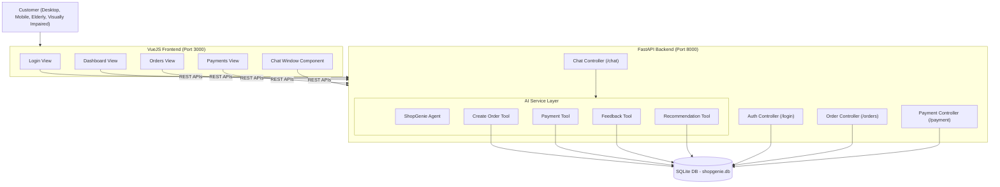
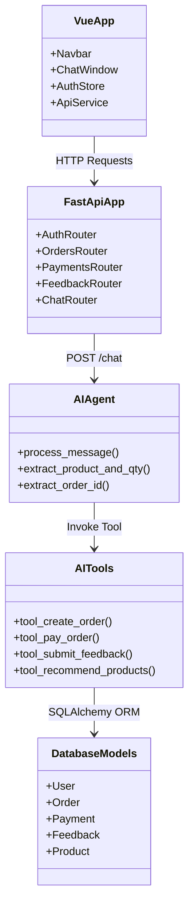
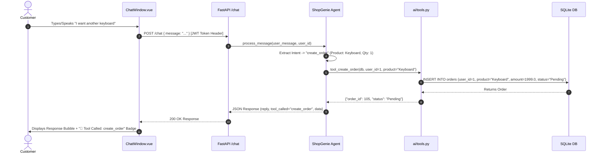

# System Diagrams - ShopGenie 🧞‍♂️

## 1. System Block Diagram

```mermaid
graph TD
    Customer["Customer (Desktop, Mobile, Elderly, Visually Impaired)"]
    
    subgraph Frontend["VueJS Frontend (Port 3000)"]
        Login["Login View"]
        Dashboard["Dashboard View"]
        OrdersView["Orders View"]
        PaymentsView["Payments View"]
        ChatWindow["Chat Window Component"]
    end
    
    subgraph Backend["FastAPI Backend (Port 8000)"]
        AuthController["Auth Controller (/login)"]
        OrderController["Order Controller (/orders)"]
        PaymentController["Payment Controller (/payment)"]
        ChatController["Chat Controller (/chat)"]
        
        subgraph AIService["AI Service Layer"]
            Agent["ShopGenie Agent"]
            OrderTool["Create Order Tool"]
            PaymentTool["Payment Tool"]
            FeedbackTool["Feedback Tool"]
            RecsTool["Recommendation Tool"]
        end
    end

    DB[(SQLite DB - shopgenie.db)]

    Customer --> Frontend
    Login & Dashboard & OrdersView & PaymentsView & ChatWindow --> |REST APIs| Backend
    ChatController --> AIService
    OrderTool & PaymentTool & FeedbackTool & RecsTool --> DB
    AuthController & OrderController & PaymentController --> DB
```

---

## 2. Component Diagram

```mermaid
classDiagram
    class VueApp {
        +Navbar
        +ChatWindow
        +AuthStore
        +ApiService
    }
    
    class FastApiApp {
        +AuthRouter
        +OrdersRouter
        +PaymentsRouter
        +FeedbackRouter
        +ChatRouter
    }

    class AIAgent {
        +process_message()
        +extract_product_and_qty()
        +extract_order_id()
    }

    class AITools {
        +tool_create_order()
        +tool_pay_order()
        +tool_submit_feedback()
        +tool_recommend_products()
    }

    class DatabaseModels {
        +User
        +Order
        +Payment
        +Feedback
        +Product
    }

    VueApp --> FastApiApp : HTTP Requests
    FastApiApp --> AIAgent : POST /chat
    AIAgent --> AITools : Invoke Tool
    AITools --> DatabaseModels : SQLAlchemy ORM
```

---

## 3. Tool Calling Sequence Diagram

```mermaid
sequenceDiagram
    autonumber
    actor User as Customer
    participant UI as ChatWindow.vue
    participant API as FastAPI /chat
    participant Agent as ShopGenie Agent
    participant Tools as ai/tools.py
    participant DB as SQLite DB

    User->>UI: Types/Speaks "I want another keyboard"
    UI->>API: POST /chat { message: "..." } [JWT Token Header]
    API->>Agent: process_message(user_message, user_id)
    Agent->>Agent: Extract Intent -> "create_order" (Product: Keyboard, Qty: 1)
    Agent->>Tools: tool_create_order(db, user_id=1, product="Keyboard")
    Tools->>DB: INSERT INTO orders (user_id=1, product="Keyboard", amount=1999.0, status="Pending")
    DB-->>Tools: Returns Order #105
    Tools-->>Agent: {"order_id": 105, "status": "Pending"}
    Agent-->>API: JSON Response (reply, tool_called="create_order", data)
    API-->>UI: 200 OK Response
    UI->>User: Displays Response Bubble + "🤖 Tool Called: create_order" Badge
```
